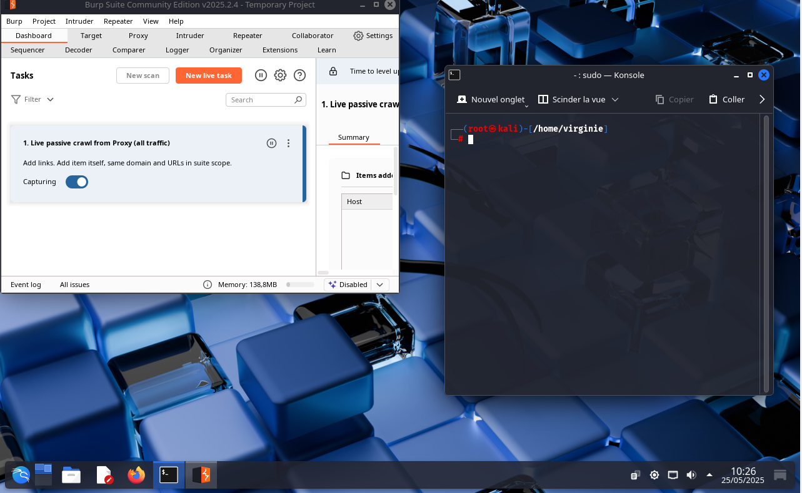

# Burp-kali-proxy

© 2025 <strong>virg736</strong> — Tous droits réservés. 
Reproduction interdite sans autorisation.

# Educational Project: Traffic Analysis Using Burp Suite on Kali Linux
## Intercepting HTTPS Traffic with Burp Suite

---

### Important Note

This project is strictly educational. It demonstrates how HTTPS traffic can be intercepted using Burp Suite.

---

## Table of Contents

1. [Launch Burp Suite](#1-launch-burp-suite)
2. [Check if the proxy is active](#2-check-if-the-proxy-is-active)
3. [Set up the proxy in Firefox](#3-set-up-the-proxy-in-firefox)
4. [Install Burp’s CA certificate in Firefox](#4-install-burps-ca-certificate-in-firefox)
5. [Perform an HTTPS browsing test](#5-https-browsing-test)
6. [Why this matters for an attacker](#6-why-this-matters-for-an-attacker)
7. [Why this is critical](#7-why-this-is-critical)
8. [Screenshots](#8-screenshots)
9. [Conclusion](#9-conclusion)

---

## Project Objective

This project demonstrates how an analyst or attacker could intercept HTTPS traffic between a web browser (Firefox) and a website, using Burp Suite as a proxy. The objective is purely educational and emphasizes the importance of certificate and network connection security.

---

## 1. Launch Burp Suite
- Open a terminal and type `burpsuite`
- Choose: **Temporary project**
- Configuration: **Use Burp defaults**
- Start with: **Start Burp**

  

---

## 2. Check if the proxy is active
- Go to **Proxy > Options**
- Confirm that the listener is active:
- Address: `127.0.0.1`
- Port: `8080`

  

---

## 3. Set up the proxy in Firefox
- Go to `about:preferences`
- Scroll down to **Network Settings**
- Click **Settings…**
- Select **Manual proxy configuration**
- HTTP Proxy: `127.0.0.1`
- Port: `8080`
- Check: **Use this proxy for all protocols**
- Confirm with **OK**

---

## 4. Install Burp’s CA certificate in Firefox
- Go to: `http://burp`
- Download the file: `cacert.der`
- Go to `about:preferences#privacy`
- Click **View Certificates**
- Import the file `cacert.der`
- Check: **Trust this CA to identify websites**
- Confirm
- 

---

## 5. HTTPS browsing test
- Open a tab in Firefox and go to: `https://exemple-securite.com`
- Switch back to **Burp Suite > Proxy > HTTP history**
- Observe the intercepted requests:
- URLs
- Headers
- Cookies
- Methods (GET, POST)

  

---

## 6. Why this matters for an attacker

An attacker could:
- Read and manipulate cookies (e.g., session hijacking)
- Inject malicious scripts or code
- Analyze vulnerable forms
- Capture credentials sent in cleartext
- Observe all exchanged data

---

## 7. Why this is critical
- Once the root certificate is installed, Burp Suite can intercept all HTTPS traffic
- If the certificate is installed via malware or deception, the user may not notice their data is being monitored

---

## 8. Screenshots

The `/captures` folder contains:
- Burp Suite launch
- Firefox proxy configuration
- Certificate installation
- Example of an intercepted request

---

## 9. Conclusion

This project demonstrates that:
- HTTPS traffic interception is possible when controlling the system or browser
- Certificate trust is essential
- Never install a certificate if you’re unsure of its origin

---

## Legal Disclaimer

This project is strictly for educational purposes.
Do not use these techniques without explicit legal authorization. Any malicious use is strictly prohibited.

---

**Virginie Lechene – Cybersecurity & Penetration Testing Training**
© 2025 Virginie Lechene — All rights reserved.
