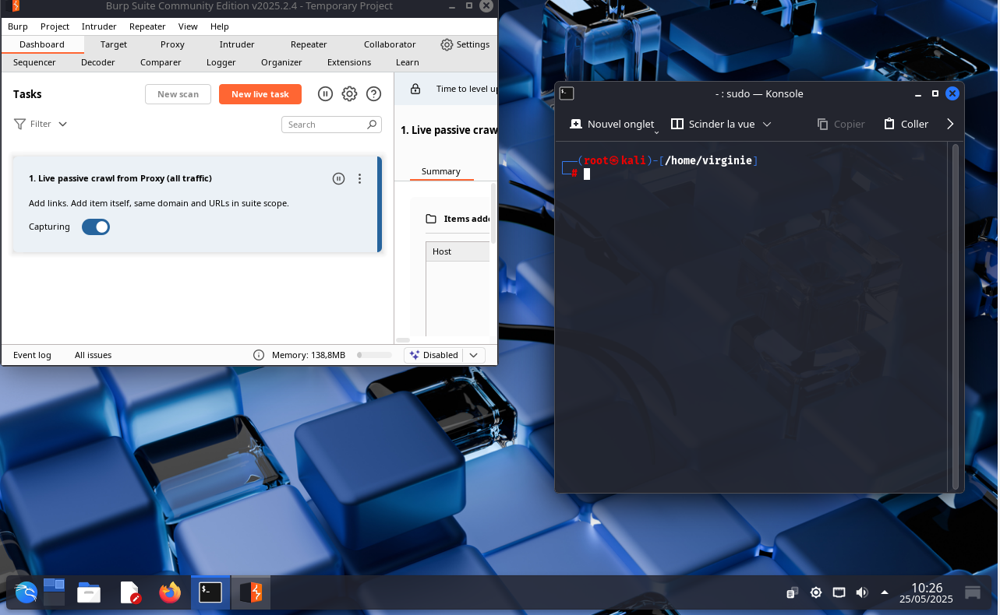

# burp-kali-proxy
Projet pédagogique : Analyse de trafic avec Burp Suite sur Kali Linux

# Interception de trafic HTTPS avec Burp Suite

> **Note importante**
> L’objectif est strictement éducatif, pour illustrer l'interception de trafic HTTPS avec Burp Suite.

## Objectif du projet

Ce projet montre comment un analyste ou un hacker pourrait intercepter le trafic HTTPS entre un navigateur web (Firefox) et un site, en utilisant **Burp Suite** comme proxy.
L'objectif est purement éducatif, pour démontrer l'importance de la sécurité des certificats et des connexions réseau.

---
### 1. Lancer Burp Suite

- Ouvrir un terminal et taper `burpsuite`
- Choisir : **Temporary project**
- Configurer : **Use Burp defaults**
- Démarrer avec : **Start Burp**

---
### 2. Vérifier que le proxy est actif

- Aller dans l’onglet **Proxy > Options**
- Vérifier que l’écouteur est activé :
- Adresse : `127.0.0.1`
- Port : `8080`

---

### 3. Configurer le proxy dans Firefox

– Aller dans `about:preferences`
– Descendre jusqu’à **Paramètres réseau**
– Cliquer sur **Paramètres…**
– Cocher : **Configuration manuelle du proxy**
– HTTP proxy : `127.0.0.1`
– Port : `8080`
– Cocher : **Utiliser ce proxy pour tous les protocoles**
– Valider avec **OK**

---
### 4. Installer le certificat CA de Burp dans Firefox

– Aller à l’adresse : `http://burp`
– Télécharger le fichier `cacert.der`
– Aller dans `about:preferences#privacy`
– Cliquer sur **Afficher les certificats > Importer**
– Importer le fichier `cacert.der`
– Cocher : **Faire confiance à ce CA pour identifier des sites web**
– Valider

---
### 5. Test de navigation HTTPS

– Ouvrir un onglet Firefox et visiter le site :
`https://exemple-securite.com`

– Retourner dans **Burp**
– Aller dans l’onglet **Proxy > HTTP history**

– Observer les requêtes interceptées :
– URLs
– Headers
– Cookies
– Méthodes (GET, POST) 

---
### 6. Intérêt pour un attaquant

Un attaquant pourrait :

– Lire et manipuler les cookies (ex. : vol de session)
– Injecter des scripts ou du code malveillant
– Analyser les formulaires vulnérables
– Capturer des identifiants envoyés en clair
– Observer toutes les données échangées

---
### 7. Pourquoi c’est critique

Une fois le certificat racine installé, **Burp** peut intercepter toutes les connexions **HTTPS**.

– Si cette installation est faite via un malware ou une ruse, l’utilisateur ne verra pas que ses données sont surveillées.

---
### 8. Captures écran

Le dossier `/captures` contient :

– Lancement de **Burp Suite**
– Configuration du proxy **Firefox**
– Installation du certificat
– Exemple de requête interceptée

---
### 9. Conclusion

Ce projet montre que :

– Il est possible d’intercepter du trafic **HTTPS** si l’on contrôle le système ou le navigateur
– La confiance dans les certificats est essentielle
– Il ne faut jamais installer un certificat dont on n’est pas sûr

#### Avertissement légal

– Ce projet est strictement pédagogique
– Ne jamais utiliser ces techniques sans autorisation légale explicite
– Toute utilisation malveillante est interdite

---

*Virginie Lechene – Formation en cybersécurité & test d’intrusion*
© 2025 Virginie Lechene — Tous droits réservés.

